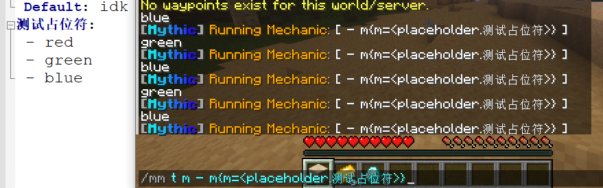
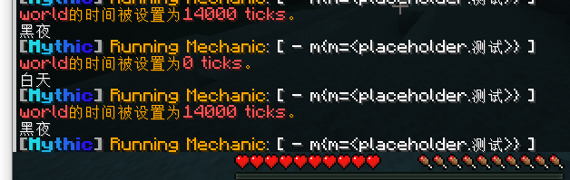

---

通常情况下 物品、技能、实体等配置应被放入 `/MythicMobs/Items`、`/MythicMobs/Skills`、`/MythicMobs/Mobss` ..  
配置包将允许把 物品、掉落物、技能、实体、掉落表、随机生成、定点生成 放入一个文件夹内加载

如:

位于 `/MythicMobs/Skills/测试-技能.yml` 内的技能组:

```yaml
测试:
 Skills:
 - message{m=1} @server
```
位于 `/MythicMobs/Mobs/测试-实体.yml` 内的实体:
```yaml
测试实体:
 Types: husk
 Drops:
 - 测试物品 1
 Skills:
 - skill:测试 @self ~onTimer:100
```
位于 `/MythicMobs/Items/测试-物品.yml` 内的物品:
```yaml
测试物品:
 Id: diamond
```

这三个`.yaml`文件可被放入 `/MythicMobs/Packs/配置包名称/对应文件夹` 内  
如: `/MythicMobs/Items/测试-物品.yml` 移动至 `/MythicMobs/Packs/测试/Items`  
 `/MythicMobs/Mobs/测试-实体.yml` 移动至 `/MythicMobs/Packs/测试/Mobs`  
 `/MythicMobs/Skills/测试-技能.yml` 移动至 `/MythicMobs/Packs/测试/Skills`

重载插件后, 哪怕 `/MythicMobs/Items/`, `/MythicMobs/Skills`, `/MythicMobs/Mobs` 内没有这些文件  
这个测试实体也可以被生成且正常工作, 即死亡后掉落一颗钻石, 每5秒向全服玩家发送信息

Lore模板与自定义占位符
-----

* 新增: placeholders.yml（默认不会生成 需安装[Crucible](https://gitlab.com/TranslatedByShark/MythicCrucible-Manual-CN/-/wikis/home)）
- 该文件需要在一个配置包文件夹内手动创建, 目前已知功能有:
  * 令占位符随机返还三行文本中的任意一行文本, 示例见下
  * 令占位符返还的值根据条件来变化, 如白天返还`白天`, 晚上返还`黑夜`， 示例见下
```yaml
### Packs/配置包/placeholders.yml
测试占位符:
- red
- green
- blue
```

```yaml
测试:
 白昼:
  Conditions:
  - night false
  Value: 白天
  黑夜:
  Conditions:
  - night
  Value: 黑夜
  Default: 都不满足就返还这个
```


* 新增: [lore-templates.yml](https://gitlab.com/TranslatedByShark/MythicCrucible-Manual-CN/-/wikis/描述模板)（默认不会生成 需安装[Crucible](https://gitlab.com/TranslatedByShark/MythicCrucible-Manual-CN/-/wikis/home)）
- 该文件需要在一个配置包文件夹内手动创建, 目前已知功能有:
  * 在物品生成时通过模板来读取多个描述模块（否则无法读取）, 示例见下
  * 在模板内可通过占位符返还描述模块（目前无法在技能中实用该占位符）

```yaml
### 物品文件
小金锭:
 Id: gold_ingot
 Display: '这是一颗MM金锭'
 Lore:
  Template: 测试模板
  Description: '嘛 这是物品自带的描述'
```
```yaml
### Packs/配置包名/lore-templates.yml
测试模板:
  Width: 54 #一行文本达到多少行才会换行
  Separator:
  - "-"
  LineOffsets:
  - 1;2
  - 3;4 
  Lines:
  - "<lore.Description>"
  - "<placeholder.1234>"
```